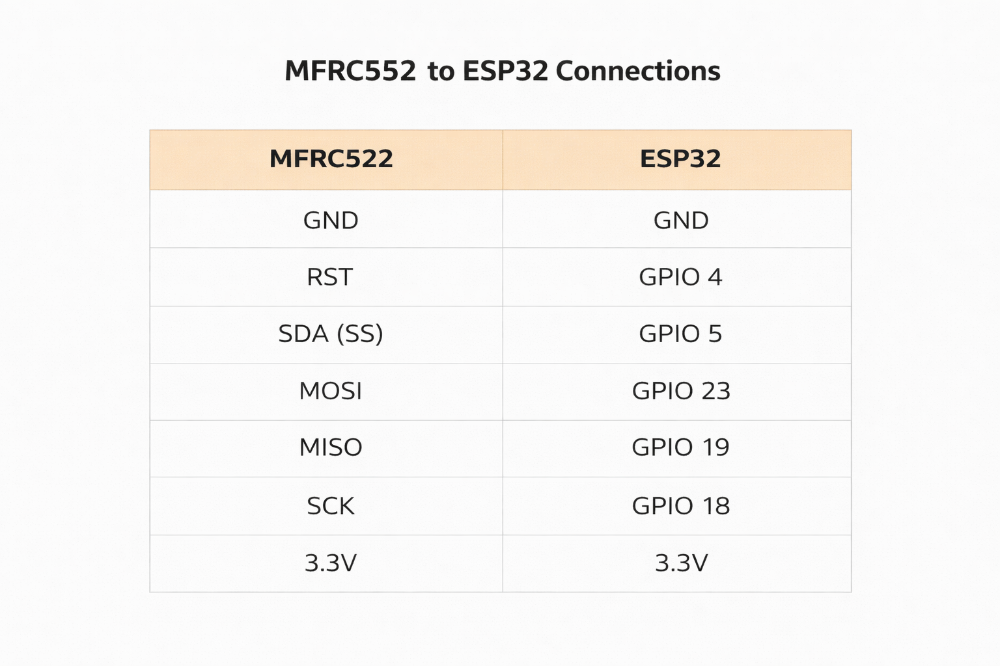
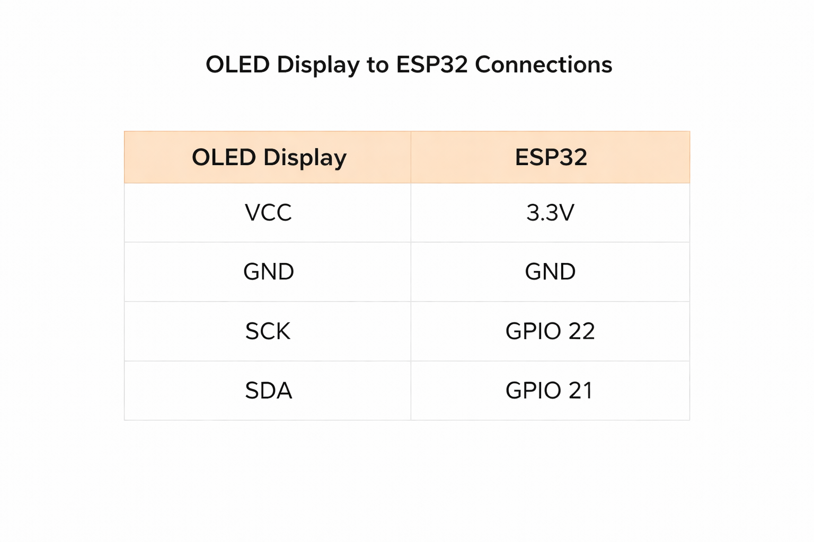
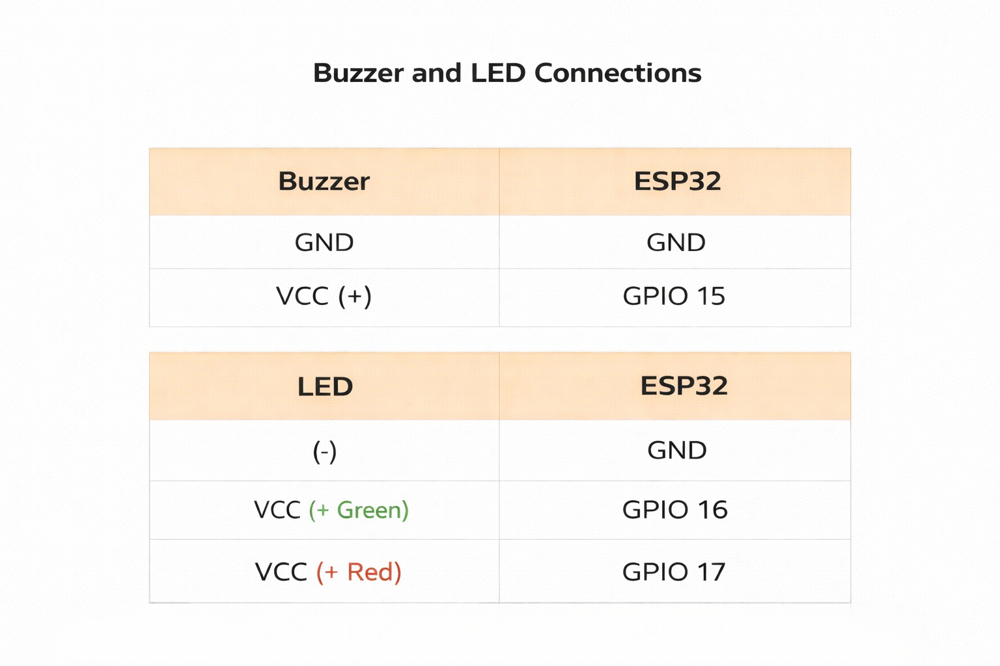
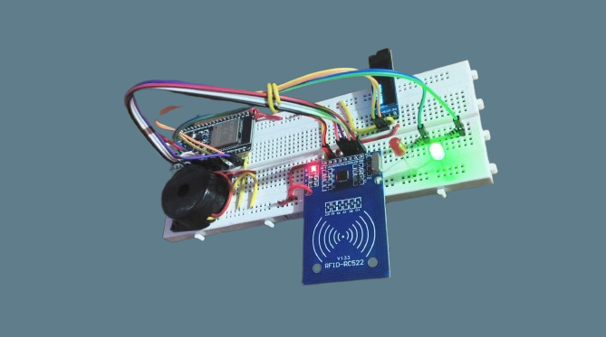
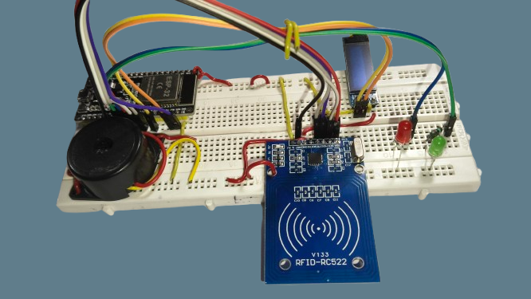
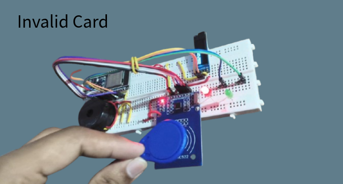
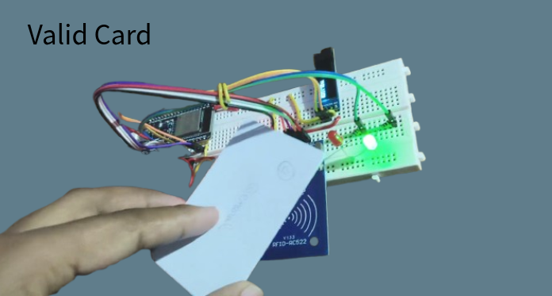

# 📡 RFID Smart Attendance System (ESP32 + Google Sheets)

An IoT-based **contactless attendance system** using ESP32 and RFID that logs real-time data directly into Google Sheets — no manual entry required.

---

## 🚀 Features

* 📡 RFID-based student identification
* 🌐 Real-time cloud logging via Wi-Fi
* 📊 Google Sheets integration (no database needed)
* 🧠 Smart Entry/Exit detection
* 🏫 Branch-wise sheet separation (CSE, ECE, IE, etc.)
* 📺 OLED display for live status
* 💡 LED + buzzer feedback system
* ⏱ NTP-based real-time clock

---

## 🧩 Workflow

1. Scan RFID card
2. ESP32 matches UID with student database
3. OLED shows **“Updating…” + Name**
4. Data sent to Google Sheets
5. System logs:

   * Entry (first scan)
   * Exit (second scan)
6. LED + buzzer give feedback

---

## 🛠 Hardware Used

* ESP32 Development Board
* MFRC522 RFID Module
* 0.91" OLED Display (128x32)
* LEDs (Green & Red)
* Buzzer
* Resistors & Jumper Wires

---

## 💻 Tech Stack

* Arduino IDE (ESP32)
* Google Apps Script (Web Backend)
* Google Sheets (Cloud Database)
* NTP (Time Sync)

---

## 📂 Data Stored

* SI No.
* Name
* Roll Number
* Branch
* Date
* Entry Time
* Exit Time

---

## ⚙️ Key Highlights

* No external database required
* Fully cloud-based system
* Low-cost & scalable
* Real-time attendance tracking

---

## 🔐 Future Improvements

* Face recognition integration
* Mobile app dashboard
* Offline sync mode
* Anti-duplicate scan system

---

## 📸 Demo

---

## 🤝 Contribution

Feel free to fork and improve the project!
